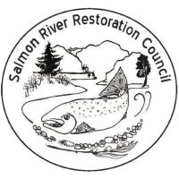

# Salmon River Restoration Council (SRRC)

## About Us

Welcome to the official GitHub repository of the Salmon River Restoration Council (SRRC). We are a community-based non-profit organization dedicated to assessing, protecting, maintaining, and restoring the ecosystems of California's spectacular Salmon River watershed.

With the active participation of the local community, our programs focus on anadromous fisheries resources and the development of a sustainable economy. Strong community partnerships are essential to our work.

We provide assistance and education to the general public and cooperating agencies by facilitating communication and cooperation between the local communities, managing agencies, Native American tribes, and other stakeholders.

SRRC’s programs include fisheries restoration, monitoring, habitat restoration; noxious weed management; water quality monitoring; fire and fuels management; watershed education; river cleanup; recreation; and more.

The Salmon River is part of the Klamath-Siskiyou Bioregion and boasts some of the most diverse and intact biological habitat in the Western US. It provides essential clean water and genetic stock for the troubled Klamath River fishery and is of great importance to the recovery of larger Klamath River watershed's health.

## Connect With Us

- Website: [https://srrc.org/](https://srrc.org/)
- Facebook: [Salmon River Restoration Council on Facebook](https://www.facebook.com/SalmonRiverRestorationCouncil)
- Email: [info@srrc.org](mailto:info@srrc.org)
- Phone: 530-462-4665

## Support Our Work

If you'd like to support our efforts in preserving the Salmon River watershed, please visit our [donation page](https://srrc.org/support) to learn how you can contribute.

## License

Unless otherwise specified, the projects in this organization are licensed under the GNU General Public License v3.0 (GPL-3.0). For more details, see the LICENSE file in each project repository or visit https://www.gnu.org/licenses/gpl-3.0.en.html.

---

© 2024 Salmon River Restoration Council. All rights reserved.